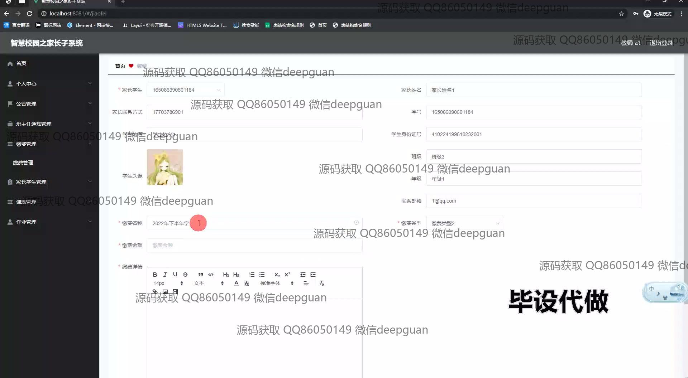

<h1 align="center">智慧校园之家长子系统</h1>

## 简介
智慧校园之家长子系统：为家长提供便捷的学生信息及缴费管理，功能涵盖充值支付、考试与成绩查询、作业与课表管理、意见反馈、公告通知等，用户体验友好，易于操作。    --计算机毕业设计源码；毕设源码；java毕业设计源码

## 联系方式

<h3 align="center">获取完整代码与数据库文件 + 微信：deepguan QQ: 86050149 QQ群: 783742310</h3>

<h3 align="center">可帮忙远程部署 包运行成功！提供远程部署、修改代码、设计文档指导、代码讲解等服务！</h3>

## 功能介绍（完整见运行截图）
家长：基本功能包括登录、查看和管理学生信息、考试成绩和家庭作业等。支付功能支持微信、支付宝和多家银行，便于处理缴费事项。家长还可以利用系统进行意见建议反馈和交流，查看奖惩记录，以及上传和下载必要的文件。

管理员：负责全局功能的管理与维护，包括用户登录管理、模块功能分配，如公告管理、通知管理、课程管理等。并能管理和查询系统数据，如家长和学生的信息、作业和成绩等条目。系统支持添加和修改权限以便个性化配置满足实际需求。

教师：可通过系统管理和分发教学任务、查看和录入学生成绩、以及通知管理来支持教学活动。教师也参与作业管理，制定作业类型和管理学生提交的作业。评分和作业反馈等功能实现教师与家长间的交流互动。

学生：使用系统查看考试成绩、作业任务和日常课表。学生还可以通过系统了解学校公告和参与意见反馈。系统对于班级和教师信息的透明化有助学生更好地规划学习，提高校园生活的整体便利性。

## 运行截图

本代码来源于网络,仅供学习参考使用!

